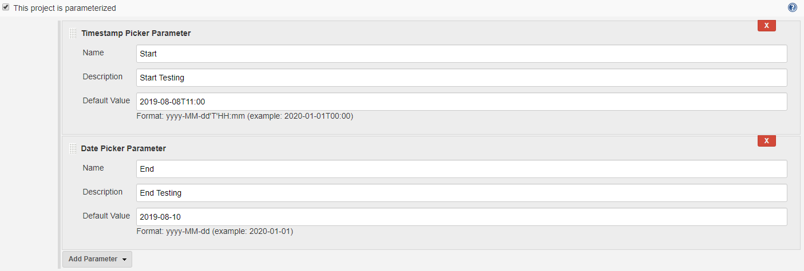
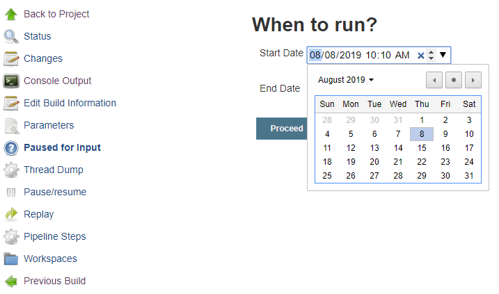
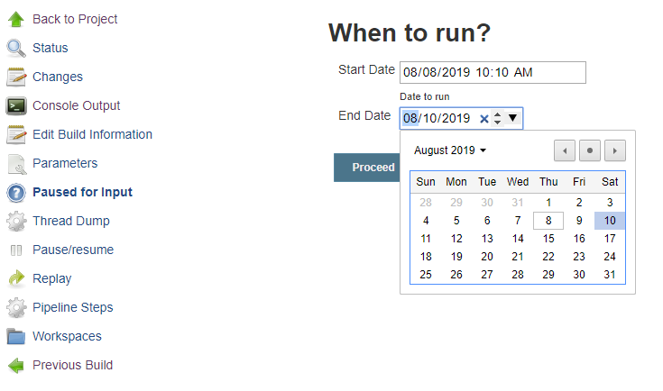

# Date Parameter Plugin (for jenkins)

[https://wiki.jenkins-ci.org/display/JENKINS/Date+Parameter+Plugin](https://wiki.jenkins-ci.org/display/JENKINS/Date+Parameter+Plugin)


### Authors:

###### JuHyun Lee | leejaycoke | leejaycoke@gmail.com

###### Vimalraj Chandra Sekaran | rajvimalc | rajvimalc@gmail.com


### About parameters:

### Class: DateParameterDefinition

- Date Format

  This is date format like Java style like `yyyyMMdd`, `dd/MM/yyyy`, `yyyy-MM-dd HH:mm:ss` whatever you want.

- Default Value

  You can use three types. LocalDate style, LocalDateTime style, or Just string suitable for `Date Format`

  1. LocalDate style example.

    (Java LocalDate style but only contains plusXXX minusXXX methods.)

    - `LocalDate.now();`
    - `LocalDate.now().plusDays(1);`
    - `LocalDate.now().minusDays(1).minusMonths(5).minusYears(1)`

  2. LocalDateTime style example.

    (Java LocalDateTime style but only contains plusXXX minusXXX methods.)

    - `LocalDateTime.now();`
    - `LocalDateTime.now().minusHours(1);`
    - `LocalDateTime.now().minusDays(1).plusMonths(5).minusSeconds(50)`

  3. String example.

    (In this case, String must suitable for `Date Format`)

    - `20170501`
    - `12/03/1988`
    - `2017`
    - `2017-01-01 00:00:00`


### Class: DatePickerDefinition

- Name: Mandatory
  
- Description: Optional
  
- Default Value:

  1. Can be blank.

  2. Format: `yyyy-MM-dd`

     Example: `2020-01-01`
 
     Defaulted to ISO format `yyyy-MM-dd` (output of `<input type="date"/>`)

### Class: TimestampPickerDefinition

- Name: Mandatory
  
- Description: Optional
  
- Default Value:

  1. Can be blank.

  2. Format: `yyyy-MM-dd'T'HH:mm`

     Example: `2020-01-01T14:10`
 
     Defaulted to ISO format `yyyy-MM-dd'T'HH:mm` (output of `<input type="datetime-local"/>`)


### Usage:

- Parameterized:



- Pipeline Script:

```
node {
    stage('Init') {
       echo ("Initializing...")
    }
    def dates = input (
        id: 'dates', 
        message: "When to run?", 
        parameters: [
            [
                $class: 'TimestampPickerDefinition', 
                defaultValue: '2019-08-08T10:10', 
                description: 'Date to run', 
                name: 'Start Date'
            ],
            [
                $class: 'DatePickerDefinition', 
                defaultValue: '2019-08-10', 
                description: 'Date to wait', 
                name: 'End Date'
            ]
        ]
    )
    echo ("Date to run: " + dates['Start Date'])
    echo ("Date to wait: " + dates['End Date'])
}
```




### Console Output:
```
Started by user VIMALRAJ CHANDRA SEKARAN
Running in Durability level: MAX_SURVIVABILITY
[Pipeline] Start of Pipeline
[Pipeline] node
Running on Jenkins in C:\Program Files (x86)\Jenkins\workspace\FirstPipelineJob
[Pipeline] {
[Pipeline] stage
[Pipeline] { (Init)
[Pipeline] echo
Initializing...
[Pipeline] }
[Pipeline] // stage
[Pipeline] input
Input requested
Approved by VIMALRAJ CHANDRA SEKARAN
[Pipeline] echo
Date to run: 2019-08-08T10:10
[Pipeline] echo
Date to wait: 2019-08-10
[Pipeline] }
[Pipeline] // node
[Pipeline] End of Pipeline
Finished: SUCCESS
```